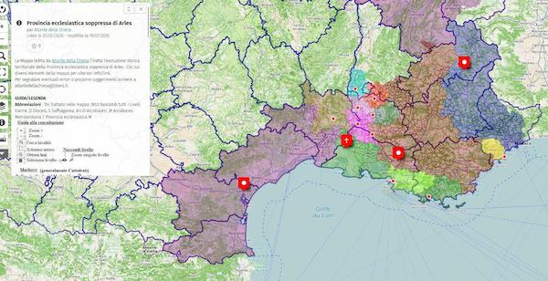

---
categories:
- Histoire
- Colonisation
- Cartographie
- Communs
- Marseille
- IA
- Libération
- Numérique
- Postcolonial
date : 08-31-2026
title: Été 2026
image: Thermidor.jpg
---

Un été plus détente que veille. J'en ai surtout profité pour des lectures ou des écoutes plus longues. Mais bon c'est malin car pour vous c'est la rentrée et l'automne est toujours chargé alors vous n'aurez peut-être pas le temps pour cela. Mais vous pouvez les mettre de côté pour les longues soirées d'hiver.

## Lu

* [Sauver nos mémoires de l’obscolescence numérique](https://www.terrestres.org/2026/07/18/sauver-nos-memoires-de-la-toile-numerique/)

> Je vais tenter durant le reste de ma mission de collecter ces documents avec minutie car je suis persuadé qu’ils renferment, une fois agrégés en un ensemble cohérent, l’histoire d’autant d’individus ainsi que les secrets nous permettant de reconstituer cet âge inconnu et les causes qui menèrent cette espèce à la funeste fin qui fut la leur.

* [Récits de voyage de manuscrits de retour dans leurs pays d’origine](https://ethiquedroit.hypotheses.org/5559)

> Le suivi de ces restitutions nous apprend donc toujours un peu sur la gestion de nos propres colletions et nous aide à mieux réfléchir sur la constitution de nos fonds et leur description.

* [Sandrine Rolengo, la battante du bâti pour qui le patrimoine “c’est pas guinguette”](https://marsactu.fr/sandrine-rolengo-la-battante-du-bati-pour-qui-le-patrimoine-cest-pas-guinguette/)

> En 2017, Sandrine Rolengo découvre, en même temps que les archéologues qui travaillent sur ce chantier de fouilles préventives, les premières traces d’une carrière antique “unique au monde”. “C’est la fondation de Marseille qu’on a soudain sous les yeux”, a-t-elle coutume de dire. En quelques jours, sa silhouette, son sourire et sa détermination deviennent le symbole de la mobilisation citoyenne pour la préservation du site antique, promis à la destruction, une fois les fouilles préventives achevées.

* [LLM : vers un « monopole radical »](https://danslesalgorithmes.net/2026/06/23/llm-vers-un-monopole-radical/)

Une longue publication de Dominique Boullier précieuse à lire : 

> Ni science, ni industrie, ni éthique mais de l’ingénierie, de la finance et du buzz

* [Ghana, rêver une nation, exposer un rêve](https://blogs.mediapart.fr/guillaume-lasserre/blog/250826/ghana-rever-une-nation-exposer-un-reve)

> Ghana ! Rêver l’indépendance réussit ce que peu d’expositions occidentales consacrées à l’Afrique parviennent à faire : montrer un pays qui se pense lui-même, par ses propres images, avant que d’autres ne viennent le penser à sa place. Le dialogue instauré entre les archives de James Barnor et de Willis Bell, d’une part, et les reconstitutions contemporaines de Carlos Idun-Tawiah, Rita Mawuena Benissan et Denyse Gawu-Mensah, d’autre part, donne à l’ensemble une respiration intergénérationnelle rare, dans laquelle l’archive ne fige jamais tout à fait le passé qu’elle documente.

## Vu

* [La Marseille résistante sous l'oeil de Julia Pirotte](https://www.arte.tv/fr/videos/128577-000-A/la-marseille-resistante-sous-l-objectif-de-julia-pirotte/)

> En pleine guerre, Julia Pirotte agit. Elle braque son appareil sur tous les parias de Vichy et de l’occupant : étrangers, militants ou crève-la-faim. Dans la cité phocéenne, Julia Pirotte capte obstinément la vie, même quand plane la mort.

* [Cartes de l'évolution des diocèces de France](https://umap.openstreetmap.fr/fr/user/Atlante%20della%20Chiesa/)

* [Les faussaires de la Bible](https://www.arte.tv/fr/videos/118584-000-A/les-faussaires-de-la-bible-1-2/)

> Au-delà de leur intérêt historique et religieux, les manuscrits, vrais et faux, constituent depuis leur découverte un enjeu majeur dans le conflit israélo-palestinien. 

* [L’envers de l’endroit {itinéraires}](https://www.frederiquelagny.com/etudes-pour-un-rideau-de-scenes/) Avec des archives des ANOM comme base de travail d'une artiste rencontrée lors d'[Art-o-rama](https://www.lafriche.org/evenements/art-o-rama-2026/)

> À la fin du 19e siècle, les manufactures européennes entrées en concurrence en Europe, imitent les motifs des cotonnades africaines allant jusqu’au ravaudage pour imiter une facture artisanale, pour le marché intérieur de leurs colonies. Ces tissus et les fils venus de Métropole, deviennent à leur tour objet de détournement par les tisserands africains, qui tissent et reproduisent certaines combinaisons de motifs pour attirer leur clientèle avec des nouveautés.

> Ces aller-retours forment le point de départ conceptuel d’un rideau de scène, qui sera complété par un protocole ouvert, de réplication et d’usage avec la contrainte de pouvoir être reproduit facilement, et à peu de frais dans un contexte de festival ou de représentation des arts vivants.

## Entendu

* Chez _ils ont changé le monde_, série en dix épisodes "[La révolution numérique](https://www.radiofrance.fr/franceculture/podcasts/serie-la-revolution-numerique)", précieux pour remettre en contexte et en profondeur historique le numérique.

> 10 épisodes, 10 dates clés, pour se réapproprier nos outils du quotidien et partir à la découverte de ces inventions technologiques qui ont participé à changer le monde.

* Chez _Radio Grenouille_, Souleymane Bachir Diagne [Quel universel depuis Marseille ?](https://www.radiogrenouille.com/tous-les-episodes/souleymane-bachir-diagne-quel-universel-depuis-marseille/) 

> Nous explorons ce chantier de remise en question qui s’opère dans les Musées français et notamment ici au MAAOA.
Quel universel depuis Marseille ?

* Chez _histoire de..._, Patrick Boucheron, [Peste noire : l'histoire à l'épreuve](https://www.radiofrance.fr/franceculture/podcasts/serie-peste-noire-l-histoire-a-l-epreuve)

> Nous sommes à la fin du mois d’août 1349. Une femme presse le pas dans les faubourgs sud de Marseille. Son nom est Alayseta Paula et elle se rend à la cour de justice. Son père, le vigneron Bertran Paul, est mort le 15 mars 1348, avant d’être suivi par la mère d’Alayseta, par son mari et par ses sœurs.

> Accablée par ses deuils, Alayseta Paula n’a pas pu faire rédiger l’inventaire après décès de son père. Le délai légal étant dépassé depuis longtemps, la voici devant la justice de Notre-Dame-des-Accoules.